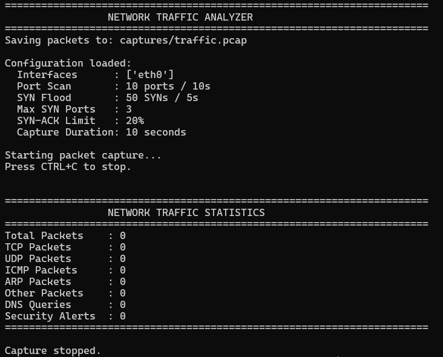
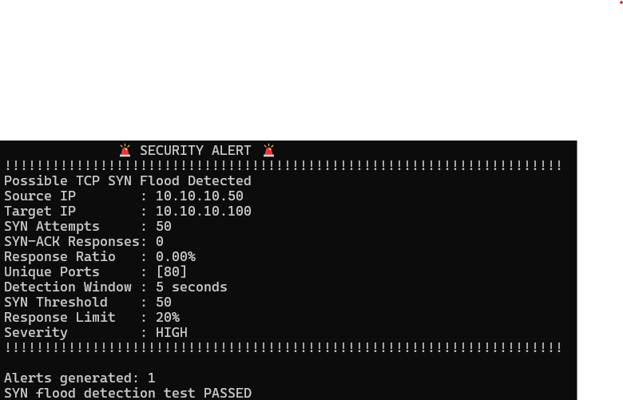

# Network Traffic Analyzer & Security Monitor

A Python-based network traffic analyzer that captures live packets, analyzes network protocols, detects suspicious traffic patterns, and generates persistent security alerts.

## Features

- Live network packet capture using Scapy
- TCP, UDP, ICMP and ARP protocol analysis
- Service and destination-port identification
- PCAP packet recording
- TCP SYN port-scan detection
- TCP SYN-flood detection
- SYN-ACK response tracking
- DNS query monitoring
- DNS anomaly detection
- Persistent JSON security-event logging
- Configurable detection thresholds
- Command-line interface
- Automated security tests

## Architecture

```text
                    Network Traffic
                           |
                           v
                  +------------------+
                  | Packet Capture   |
                  |     Scapy        |
                  +--------+---------+
                           |
                           v
                  +------------------+
                  | Protocol         |
                  | Analysis         |
                  +--------+---------+
                           |
             +-------------+-------------+
             |             |             |
             v             v             v
        TCP Analysis   DNS Analysis   ARP/ICMP
             |
       +-----+------+
       |            |
       v            v
   Port Scan    SYN Flood
   Detection    Detection
       |            |
       +-----+------+
             |
             v
     Security Event Logger
             |
             v
       JSON Alert Logs

## Screenshots

Screenshots demonstrating live packet capture, Wireshark analysis, security alerts, and traffic statistics will be added here.

## Testing

All major detection modules have been tested successfully, including:

- DNS detection
- Security event logging
- TCP SYN-flood detection
- Configuration loading
- Command-line interface
- Live packet capture

## Future Improvements

- Real-time monitoring dashboard
- IP reputation integration
- Email/webhook notifications
- Database-backed security events
- Machine-learning-based anomaly detection

## Screenshots

### Live Packet Capture


### TCP SYN Flood Detection


